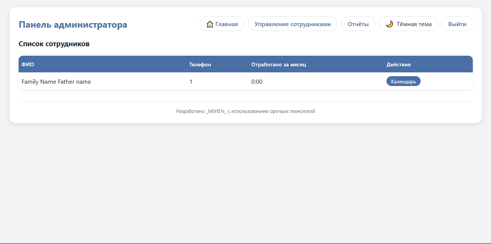
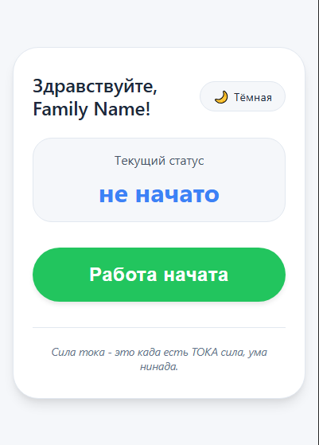

# 🕒 Worktime – Учёт рабочего времени

<p align="center">
  
  
  
  
  
</p>

<p align="center">
  <strong>Веб-приложение для учёта рабочего времени сотрудников</strong><br>
  Мобильный интерфейс для отметок «пришёл/ушёл», панель администратора с календарём и отчётами.
</p>

---

## ✨ Возможности

- 🔐 **Авторизация администратора** (единый вход).
- 👥 **Управление сотрудниками**: добавление, редактирование, удаление.
- 📲 **Уникальные ссылки для сотрудников** – каждый получает свою страницу с кнопками:
  - «Работа начата»
  - «Пауза» / «Возобновить»
  - «Закончить работу»
- 📅 **Календарь для администратора** с отображением часов за каждый день:
  - Просмотр за 3 месяца.
  - Корректировка времени (+/– час, произвольное редактирование с комментариями).
  - Выделение выходных и праздников.
- 📊 **Отчёты за произвольный период** с экспортом в Excel:
  - Детализация по дням (приход, уход, часы).
  - Итоговая сумма за период.
- 🌙 **Тёмная тема** на всех страницах.

---

## 📸 Скриншоты

*(Добавьте скриншоты в папку `screenshots/` и укажите ссылки ниже)*

| Страница администратора | Мобильный интерфейс |
|-------------------------|---------------------|
|  |  |

---

## 📁 Структура проекта

```
Worktime_RoM/
├── app.py                      # Основной файл приложения
├── models.py                   # Модели базы данных
├── requirements.txt            # Зависимости
├── .gitignore                  # Игнорируемые Git файлы
├── README.md                   # Документация
├── templates/                  # HTML шаблоны
│   ├── admin/                  # Для администратора
│   │   ├── base.html           # Базовый шаблон (навигация + тема)
│   │   ├── login.html          # Вход
│   │   ├── dashboard.html      # Панель управления
│   │   ├── employees.html      # Управление сотрудниками
│   │   ├── reports.html        # Отчёты
│   │   └── calendar.html       # Календарь сотрудника
│   └── employee/               # Для сотрудников
│       └── panel.html          # Мобильный интерфейс
├── static/                     # CSS, JS, изображения (опционально)
└── instance/                   # Папка для базы данных (создаётся автоматически)
    └── worktime.db             # SQLite база данных
```

---

## 🚀 Быстрый старт

### Предварительные требования
- Python 3.8 или выше
- Git (опционально)

### 1. Клонирование репозитория
```bash
git clone https://github.com/morten2457/Worktime_RoM.git
cd Worktime_RoM
```

### 2. Создание виртуального окружения
**Windows (cmd/PowerShell):**
```bash
python -m venv venv
venv\Scripts\activate
```

**macOS/Linux:**
```bash
python3 -m venv venv
source venv/bin/activate
```

### 3. Установка зависимостей
```bash
pip install -r requirements.txt
```

### 4. Запуск приложения
```bash
python app.py
```

Приложение будет доступно по адресу: [http://127.0.0.1:5000](http://127.0.0.1:5000)

### 5. Вход в панель администратора
- **Логин:** `admin`
- **Пароль:** `admin123`

⚠️ **Важно:** В production смените пароль и секретный ключ в `app.py`!

---

## 📖 Использование

### 👨‍💼 Администратор
- **Добавление сотрудника**: заполните форму, скопируйте сгенерированную ссылку и отправьте её сотруднику.
- **Календарь**: просматривайте отработанные часы за каждый день, вносите корректировки, оставляйте комментарии.
- **Отчёты**: выберите период, получите сводку или скачайте Excel‑файл с детализацией.
- **Редактирование/удаление сотрудников**: используйте иконки ✏️ и 🗑️ в списке.

### 👷 Сотрудник
- Перейдите по своей уникальной ссылке (например, `http://ваш-сервер:5000/employee/...`).
- Нажимайте кнопки в соответствии с действиями: начало работы, пауза, возобновление, окончание.
- Статус отображается над кнопками.

---

## 🌐 Развёртывание на сервере

Для доступа из интернета запустите приложение на всех интерфейсах:

```bash
python app.py --host=0.0.0.0
```

Убедитесь, что порт 5000 открыт в файрволе. Для production рекомендуется использовать **gunicorn** + **nginx** с HTTPS.

Пример с gunicorn:
```bash
pip install gunicorn
gunicorn -w 4 -b 0.0.0.0:5000 app:app
```

---

## 🤝 Вклад в проект

Если вы нашли ошибку или хотите предложить улучшение – создайте **Issue** или отправьте **Pull Request**.

---

## 📄 Лицензия

Проект распространяется под лицензией **MIT**.  
Это означает, что вы можете свободно использовать, модифицировать и распространять код, но обязаны сохранить уведомление об авторских правах.  
Подробнее: [https://opensource.org/licenses/MIT](https://opensource.org/licenses/MIT)

---

## ✍️ Автор

**M0rtEN**  
GitHub: [@morten2457](https://github.com/morten2457)

---

<p align="center">
  ⭐ Если проект оказался полезным, поставьте звёздочку на GitHub!
</p>

